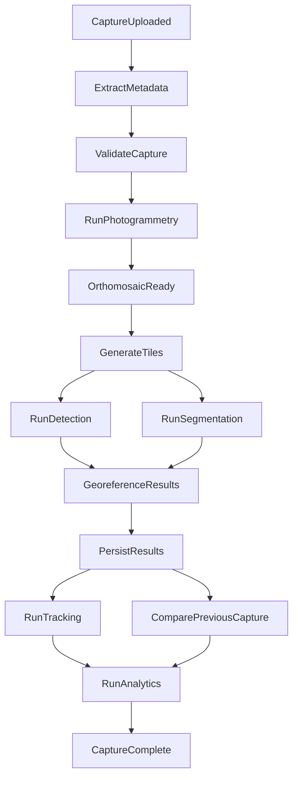
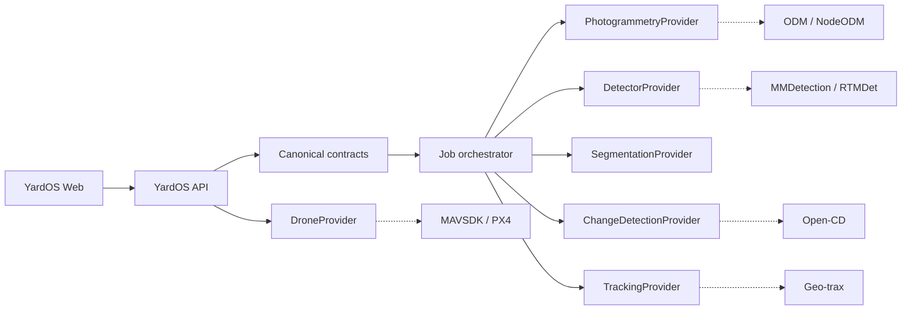

# YardOS system architecture

YardOS owns the contracts, orchestration, persistence, and APIs. Open-source systems are replaceable providers behind YardOS interfaces; none of their native response shapes are exposed to the frontend or business logic.

## Processing path

```text
DJI capture
  -> ingestion / validation
  -> PhotogrammetryProvider (NodeODM in production)
  -> canonical orthomosaic + mapping artifacts in S3/MinIO
  -> tiling / geospatial preparation
  -> DetectorProvider + SegmentationProvider
  -> canonical detections / segmentations
  -> georeferencing
  -> Postgres / PostGIS metadata and geometry
  -> YardOS API / GeoJSON
  -> MapLibre UI
```

The worker implements this explicit job DAG:



Large binaries use `s3://yardos/sites/{site_id}/captures/{capture_id}/...` URIs. Postgres/PostGIS stores structured records and geometry. Local development can resolve the same URI layout through `LocalArtifactStore`; production uses `MinioArtifactStore` or an S3-compatible replacement.

## Product pipeline

```text
DJI -> NodeODM -> one yard map -> detector -> generic vehicles
 -> Houston yard training data -> trailers / containers / tractors / chassis / equipment
```

VisDrone is only bootstrap training data for generic aerial vehicles. It does not contain YardOS-specific yard labels.

## Drone control boundary

Drone control is deliberately separate from image processing:

```text
YardOS -> DroneProvider -> MAVSDK -> PX4
```

Simulation is the default. Real flight requires both `DRONE_MODE=mavsdk` and `DRONE_ALLOW_REAL_FLIGHT=true`.

## Replaceable provider boundary



Only dashed adapter edges may contain upstream-specific types. APIs, database records,
events, and UI payloads use YardOS contracts.
